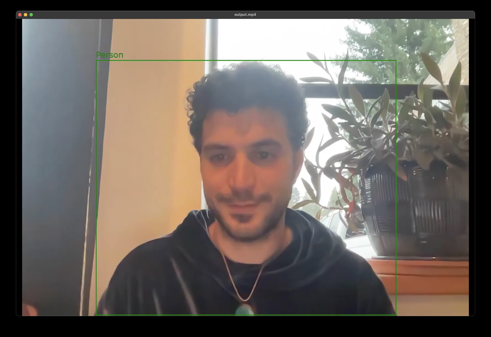
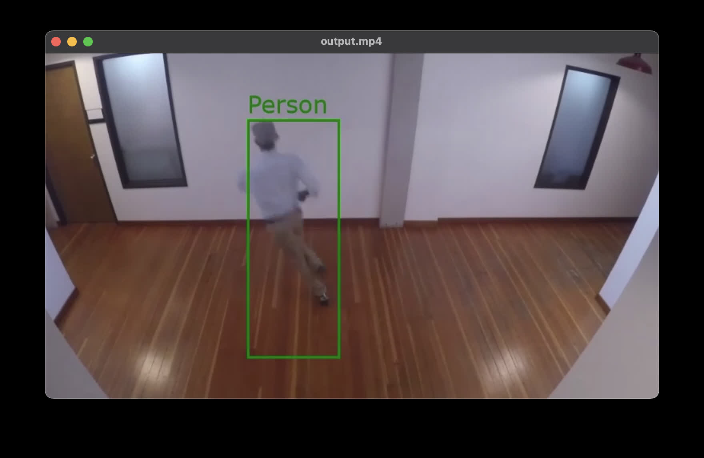

# 'drawtext' and 'drawbox' FFmpeg Sendcmd Script

The following is a script to processes a given CSV file with object detection data and generates a `sendcmd` manifest for annotating video frames with FFmpeg. 

The [sendcmd filter](https://ffmpeg.org/ffmpeg-filters.html#sendcmd_002c-asendcmd) allows FFmpeg to reinitialize a video filter (e.g.: 'drawtext' and 'drawbox') with a given start and stop time.

The script will draw bounding boxes and text labels to the video, based on the provided data.

In both examples `input.json` was generated using AWS Rekognition demo page.




## Features

- Reads a CSV file with object detection data.
- Generates an FFmpeg-compatible `sendcmd` manifest.
- Executes the FFmpeg command to draw the bounding boxes and text annotations into the frame.

## Requirements

- Python 3.6 or higher

## Usage

1. Prepare a CSV file with the following structure:
    ```
    Timestamp,Label,Width,Height,Left,Top
    0,Person,0.673,0.860,0.165,0.139
    500,Person,0.673,0.861,0.165,0.138
    ...
    ```

2. Run the script:
    ```bash
    python generate_sendcmd.py <path_to_csv_file>
    ```

3. Use the generated `sendcmd.txt` file with FFmpeg:
    ```bash
    ffmpeg -y -i input.mp4 -vf 'sendcmd=f=sendcmd.txt,drawbox,drawtext' output.mp4
    ```

## Example FFmpeg sendcmd manifest

```
0.0 [enter] drawtext reinit 'fontsize=30:fontcolor=green:text=Person:x=0.165*W:y=0.139*H-30', drawbox x '0.165*in_w', drawbox y '0.139*in_h', drawbox w '0.673*in_w', drawbox h '0.860*in_h';
0.5 [enter] drawtext reinit 'fontsize=30:fontcolor=green:text=Person:x=0.165*W:y=0.138*H-30', drawbox x '0.165*in_w', drawbox y '0.138*in_h', drawbox w '0.673*in_w', drawbox h '0.861*in_h';
1.0 [enter] drawtext reinit 'fontsize=30:fontcolor=green:text=Person:x=0.166*W:y=0.136*H-30', drawbox x '0.166*in_w', drawbox y '0.136*in_h', drawbox w '0.678*in_w', drawbox h '0.863*in_h';
1.5 [enter] drawtext reinit 'fontsize=30:fontcolor=green:text=Person:x=0.200*W:y=0.126*H-30', drawbox x '0.200*in_w', drawbox y '0.126*in_h', drawbox w '0.676*in_w', drawbox h '0.873*in_h';
2.0 [enter] drawtext reinit 'fontsize=30:fontcolor=green:text=Person:x=0.230*W:y=0.125*H-30', drawbox x '0.230*in_w', drawbox y '0.125*in_h', drawbox w '0.686*in_w', drawbox h '0.873*in_h';
2.5 [enter] drawtext reinit 'fontsize=30:fontcolor=green:text=Person:x=0.169*W:y=0.119*H-30', drawbox x '0.169*in_w', drawbox y '0.119*in_h', drawbox w '0.690*in_w', drawbox h '0.880*in_h';
3.0 [enter] drawtext reinit 'fontsize=30:fontcolor=green:text=Person:x=0.102*W:y=0.127*H-30', drawbox x '0.102*in_w', drawbox y '0.127*in_h', drawbox w '0.692*in_w', drawbox h '0.872*in_h';
3.5 [enter] drawtext reinit 'fontsize=30:fontcolor=green:text=Person:x=0.153*W:y=0.110*H-30', drawbox x '0.153*in_w', drawbox y '0.110*in_h', drawbox w '0.702*in_w', drawbox h '0.889*in_h';
4.0 [enter] drawtext reinit 'fontsize=30:fontcolor=green:text=Person:x=0.152*W:y=0.113*H-30', drawbox x '0.152*in_w', drawbox y '0.113*in_h', drawbox w '0.717*in_w', drawbox h '0.886*in_h';
4.5 [enter] drawtext reinit 'fontsize=30:fontcolor=green:text=Person:x=0.124*W:y=0.107*H-30', drawbox x '0.124*in_w', drawbox y '0.107*in_h', drawbox w '0.742*in_w', drawbox h '0.892*in_h';
5.0 [enter] drawtext reinit 'fontsize=30:fontcolor=green:text=Person:x=0.124*W:y=0.106*H-30', drawbox x '0.124*in_w', drawbox y '0.106*in_h', drawbox w '0.738*in_w', drawbox h '0.893*in_h';
```

## License

This project is licensed under the MIT License. See the [LICENSE](LICENSE) file for details.
